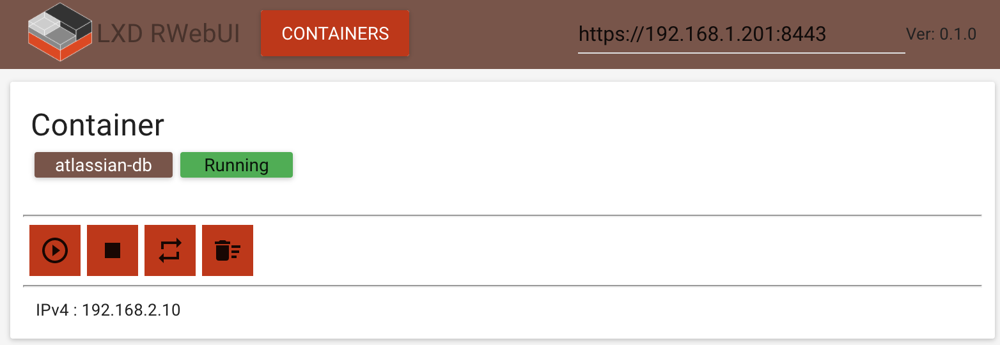

LXD Web User Interface
===

### Functionality
1. Containers
    * list
    * start
    * stop 
    * restart 
    
### TODO
1. Containers - all api functionality
2. Images - all api functionality
3. Profiles - all api functionality
4. ???

