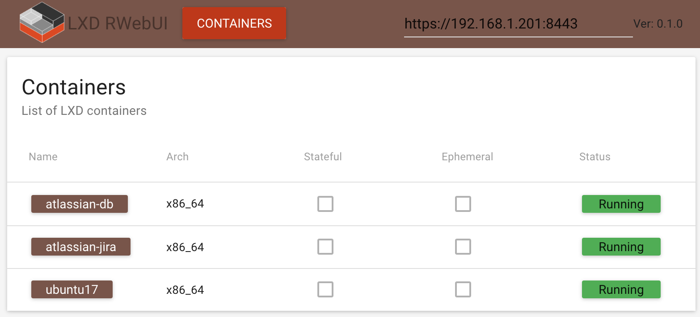

LXD Web User Interface
===

### Functionality
1. Containers
    * list
    
### TODO
1. Containers - all api functionality
2. Images - all api functionality
3. Profiles - all api functionality
4. ???

Right now there is no option to set LXD host from the interface.
Settings are in ***src/utils/helpers.js***

[]
